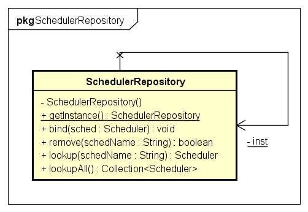
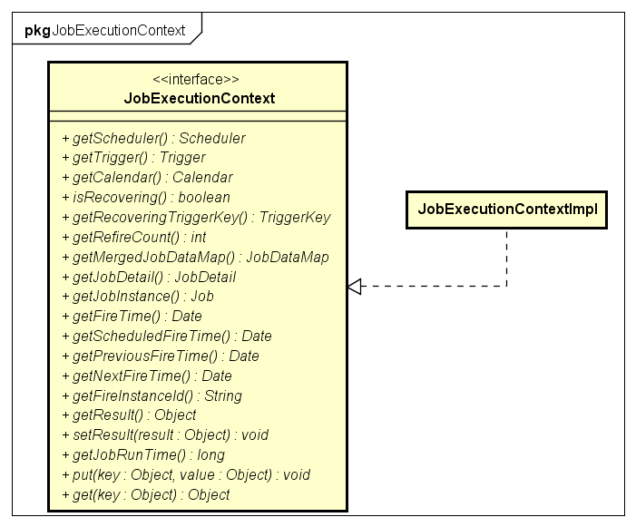
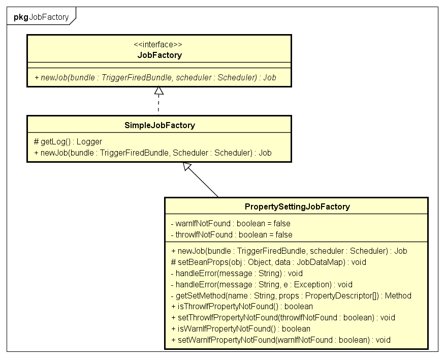
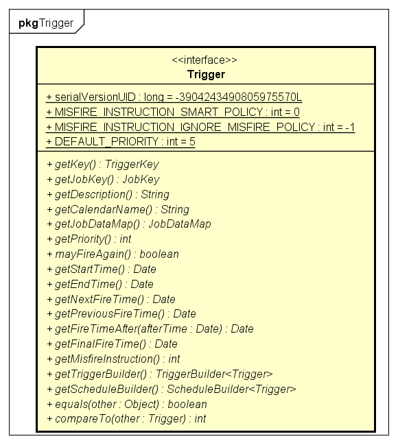
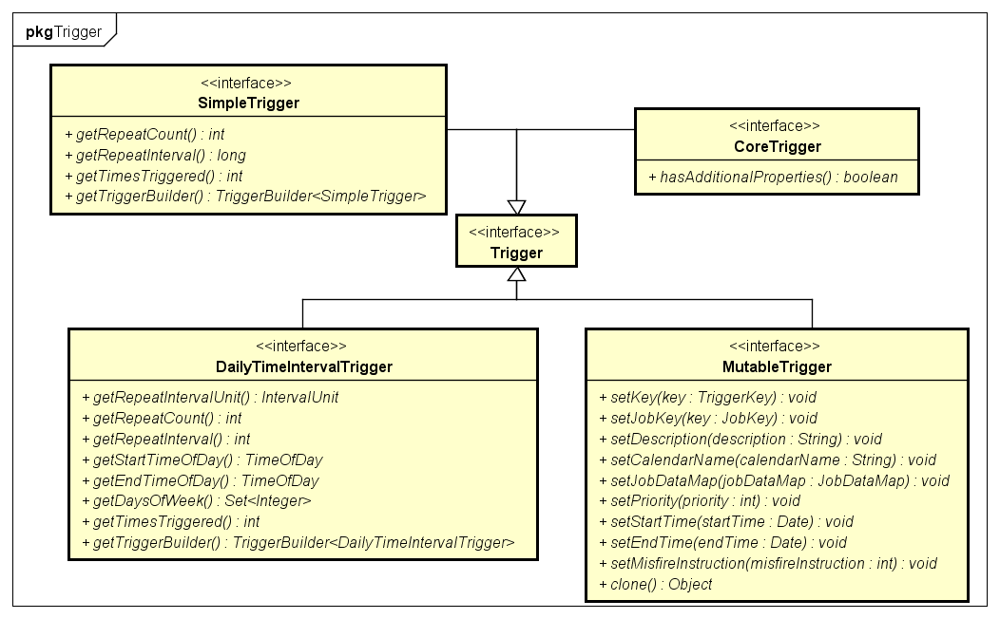
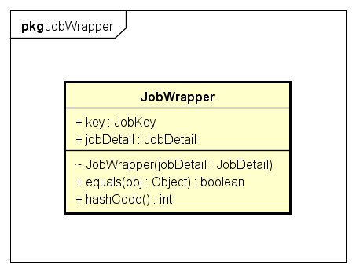

# Quartz

## Quartz 主要API
- Scheduler 任务调度器，按照特定的触发规则，自动执行任务
- Job 接口，通过实现该接口定义需要执行的任务
- JobDetail 用于定义Job实例，包含了job的基本信息
- Trigger 描述Job执行的时间触发规则
- JobStore 接口，存放Job、Trigger等信息

## Scheduler
Scheduler是一个任务调度器，保存JobDetail和Trigger的信息。 在Trigger触发时，执行特定任务。
  
实现了`org.quartz.Scheduler`接口的StdSchedule实际只是QuartzScheduler的静态代理，后者实现了Scheduler所有操作。  

### 创建
Scheduler由SchedulerFactory创建。  
SchedulerFactory有两个默认实现StdSchedulerFactory和DirectSchedulerFactory。  
  
Scheduler的创建过程包括：
- 1. 读取配置文件, 配置文件中需要配置scheduler、线程池、jobStore、jobListener、triggerListenner、插件等。配置文件的读取过程如下：
	- 读取参数系统参数System中配置的org.quartz.properties指定的文件
	- 如果找不到则读取项目Classpath目录下的quartz.properties配置文件
	- 如果找不到则读取quartz jar包中默认的配置文件quartz.properties
- 2. 从SchedulerRepository中根据名称读取已经创建的scheduler，
- 3. 如果没有则重新创建一个，并保存在SchedulerRepository中。

### 存储
Scheduler存储在单例的SchedulerRepository中。    
  
 
### 生命周期
Scheduler的生命周期开始于其被创建时，结束于shutdown()方法调用。一旦对象创建完成，就可以用来操作Jobs和Triggers，包括添加、删除、查询等。但只有在Scheduler start()被调用后，才会按照Trigger定义的触发规则执行Job的内容。  
  

### 核心方法
Scheduler的核心功能就是操作Job、Trigger、Calendar、Listener等。包括addXXX、deleteXXX、pauseXXX、resumeXXX等。  
  

## Job
### Job接口简介
Job就是定时任务实实在在执行的内容，足够单纯，仅仅包含一个执行方法:  
```java  
void execute(JobExecutionContext context) throws JobExecutionException;  
```  
JobExecutionContext对象包含了当前任务执行的上下文环境，包括JobDetail、Trigger以及jobDataMap等。  
  
Job的执行并不是孤立封闭的，需用与外界交互。JobDataMap是一种扩展的Map<String，Object>结构，就是用来在任务调度器与任务执行之间传递数据。如果Job中包含了与JobDataMap中key值相对应的setter方法，那么Scheduler容器将会在当前Job创建后自动调用该setter方法，完成数据传递，而不用hardcode的从map中取值。  
Scheduler控制在每次Trigger触发时创建Job实例。因此JobExecutionContext.JobDataMap只是外部Scheduler容器中JobDataMap的一个拷贝，即便修改Job中的JobDataMap也只是在当前Job执行的环境中生效，并不会对外部产生任何影响。  

### Job的派生
Job下面又派生出两个子接口：InterruptableJob和StatefulJob  
  
InterruptableJob：可被阻断的Job，InterruptableJob收到Scheduler.interrupt请求，停止任务  
StatefulJob：有状态Job，标识性接口，没有操作方法。StatefulJob与普通的Job（无状态Job）从根本上有两点不同：  
	1. JobDataMap是共享的，即在Job中对JobDataMap的操作，将会被保存下来，其他Job拿到的将是被修改过的JobDataMap。  
	2. 基于第一条原因，StatefulJob是不允许并发执行的。  
StatefulJob已被DisallowConcurrentExecution/PersistJobDataAfterExecution注解取代  

### Job的创建
Job的创建由专门的工厂来完成  
  
上面已经提到，Job的创建受Scheduler控制，因此不需要外部参与。  

## JobDetail
JobDetail用于保存Job相关的属性信息  
  
- JobKey唯一确定了一个Job  
- JobDataMap用于存储Job执行时必要的业务信息  
- JobDetail保存的仅仅是Job接口的Class对象，而非具体的实例。  
JobBuilder负责JobDetail实例的创建，并且JobBuilder提供了链式操作，可以方便的为JobDetail添加额外的信息。  
```java
JobDetail job = JobBuilder.newJob(HelloJob.class)
					.withIdentity(jobKey)
					.build();
```
## Trigger
Trigger描述了Job的触发规则。  
  
- TriggerKey(group,name)唯一标识了Scheduler中的Trigger  
- JobKey指向了该Trigger作用的Job  
- 一个Trigger仅能对应一个Job，而一个Job可以对应多个Trigger  
- 同样的，Trigger也拥有一个JobDataMap  
- Priority：当多个trigger拥有相同的触发时间，根据该属性来确定先后顺序，数值越大越靠前，默认5，可为正负数  
- Misfire Instructions：没来得及执行的机制。同一时间trigger数量过多超过可获得的线程资源，导致部分trigger无法执行。不同类型的Trigger拥有不同的机制。当Scheduler启动时候，首先找到没来得及执行的trigger，再根据不同类型trigger各自的处理策略处理  
- Calendar：Quartz Calendar类型而不是java.util.Calendar类型。用于排除Trigger日程表中的特定时间范围，比如原本每天执行的任务，排除非工作日  

### Trigger的几种状态
- STATE_WAITING（默认）: 等待触发
- STATE_ACQUIRED：  
- STATE_COMPLETE：  
- STATE_PAUSED：  
- STATE_BLOCKED：  
- STATE_PAUSED_BLOCKED：  
- STATE_ERROR：  

### Trigger的分类
  
常见的两种Trigger为SimpleTrigger和CronTrigger.  

### SimpleTrigger
SimpleTrigger支持在特定时间点一次性执行或延迟执行N次，使用TriggerBuilder和SimpleScheduleBuilder创建
SimpleTrigger包含的属性为：  
- startTime  开始时间
- endTime 如果指定的话，将会覆盖repeat count  
- repeat count 重复次数 >=0 int  
- repeat interval 时间间隔(毫秒) >=0 long  

### CronTrigger  
CronTrigger支持多次重复性复杂情况，支持Cron表达式，使用TriggerBuilder和CronScheduleBuilder创建。  
Cron表达式由7部分组成，分别是秒 分 时 日期 月份 星期 年（可选），空格间隔。  

|字段|允许值|允许的特殊字符|
|:-:|:-:|:-:|
|秒|0-59|, - * /|
|分|0-59|	, - * /|
|小时|0-23|, - * /|
|日期|1-31|, - * ? / L W C|
|月份|1-12,JAN-DEC|, - * /|
|星期|1-7,SUN-SAT|, - * ? / L C #|
|年（可选）|留空,1970-2099|, - * /|

特殊字符含义  
- "*": 代表所有可能的值  
- "/": 用来指定数值的增量, 在子表达式（分钟）里的0/15表示从第0分钟开始，每15分钟;在子表达式（分钟）里的"3/20"表示从第3分钟开始，每20分钟（它和"3，23，43"）的含义一样  
- "?": 仅被用于天和星期两个子表达式，表示不指定值。当2个子表达式其中之一被指定了值以后，为了避免冲突，需要将另一个子表达式的值设为"?"  
- "L": 仅被用于天和星期两个子表达式，它是单词"last"的缩写。如果在“L”前有具体的内容，它就具有其他的含义了。例如："6L"表示这个月的倒数第６天，"FRI L"表示这个月的最后一个星期五  
- 'W' 可用于“日”字段。用来指定历给定日期最近的工作日(周一到周五) 。比如你将“日”字段设为"15W"，意为: "离该月15号最近的工作日"。因此如果15号为周六，触发器会在14号即周五调用。如果15号为周日, 触发器会在16号也就是周一触发。如果15号为周二,那么当天就会触发。然而如果你将“日”字段设为"1W", 而一号又是周六, 触发器会于下周一也就是当月的3号触发,因为它不会越过当月的值的范围边界。'W'字符只能用于“日”字段的值为单独的一天而不是一系列值的时候  
- 'L'和'W'可以组合用于“日”字段表示为'LW'，意为"该月最后一个工作日"。  
- '#' 字符可用于“周几”字段。该字符表示“该月第几个周×”，比如"6#3"表示该月第三个周五( 6表示周五而"#3"该月第三个)。再比如: "2#1" = 表示该月第一个周一而 "4#5" = 该月第五个周三。注意如果你指定"#5"该月没有第五个“周×”，该月是不会触发的。  
- 'C' 字符可用于“日”和“周几”字段，它是"calendar"的缩写。 它表示为基于相关的日历所计算出的值（如果有的话）。如果没有关联的日历, 那它等同于包含全部日历。“日”字段值为"5C"表示"日历中的第一天或者5号以后"，“周几”字段值为"1C"则表示"日历中的第一天或者周日以后"。  
表达式举例   
- "0 0 12 * * ?" 每天中午12点触发   
- "0 15 10 ? * *" 每天上午10:15触发   
- "0 15 10 * * ?" 每天上午10:15触发   
- "0 15 10 * * ? *" 每天上午10:15触发   
- "0 15 10 * * ? 2005" 2005年的每天上午10:15触发   
- "0 * 14 * * ?" 在每天下午2点到下午2:59期间的每1分钟触发   
- "0 0/5 14 * * ?" 在每天下午2点到下午2:55期间的每5分钟触发   
- "0 0/5 14,18 * * ?" 在每天下午2点到2:55期间和下午6点到6:55期间的每5分钟触发   
- "0 0-5 14 * * ?" 在每天下午2点到下午2:05期间的每1分钟触发   
- "0 10,44 14 ? 3 WED" 每年三月的星期三的下午2:10和2:44触发   
- "0 15 10 ? * MON-FRI" 周一至周五的上午10:15触发   
- "0 15 10 15 * ?" 每月15日上午10:15触发   
- "0 15 10 L * ?" 每月最后一日的上午10:15触发   
- "0 15 10 ? * 6L" 每月的最后一个星期五上午10:15触发   
- "0 15 10 ? * 6L 2002-2005" 2002年至2005年的每月的最后一个星期五上午10:15触发   
- "0 15 10 ? * 6#3" 每月的第三个星期五上午10:15触发   

定时器正则表达式验证  
<pre>秒：^(\\*|[0-5]?[0-9]([,|\\-|\\/][0-5]?[0-9])*)$  
分：^(\\*|[0-5]?[0-9]([,|\\-|\\/][0-5]?[0-9])*)$  
时：^(\\*|([0-1]?[0-9]?|2[0-3])([,|\\-|\\/]([0-1]?[0-9]|2[0-3]))*)$  
日期：^(\\*|\\?|(([1-9]|[1-2][0-9]|3[0-1])([,|\-|\/]([1-9]|[1-2][0-9]|3[0-1]))*)[CLW]?|[CLW]|LW)$  
月份：^((\\*|[1-9]|(1[0-2]))([,|\-|\/]([1-9]|(1[0-2])))*)$  
星期：^(\\*|L|\\?|[1-7](([,|\-|\/|\#][1-7])*|[LC]))$  
年：^(\\*?|2[0-9]{3}([,|\-|\/]2[0-9]{3})*)$</pre>  

## Job Store
Job Store用于保存jobs, triggers等对应数据。JobStore的配置应在Quartz的配置文件中配置，代码中应该避免直接操作JobStore实例  
JobStroe的实现包括：  
- RAMJobStore：把所有数据保存在内容中，速度快但没能持久化。配置org.quartz.jobStore.class = org.quartz.simpl.RAMJobStore  
- JDBCJobStore：通过jdbc把数据保存在数据库中  
- TerracottaJobStore：  

### RAMJobStore
  
#### JobDetail的存储载体：  
JobWrapper:  
  
```java
// 以JobDetail的group为key，存储JobKey<->JobWrapper形式的Map结构的Map
HashMap<String, HashMap<JobKey, JobWrapper>> jobsByGroup
// 以JobKey为Key，存储JobWrapper的Map
HashMap<JobKey, JobWrapper> jobsByKey
```  
  

#### Trigger的存储载体:  
TriggerWrapper:  
  
```java
// 存储所有的TriggerWrapper
ArrayList<TriggerWrapper> triggers
// 以Trigger的group为key，存储TriggerKey<->TriggerWrapper形式的Map结构的Map
HashMap<String, HashMap<TriggerKey, TriggerWrapper>> triggersByGroup
// 以TriggerKey为Key，存储TriggerWrapper
HashMap<TriggerKey, TriggerWrapper> triggersByKey
// 即将被触发的Trigger
TreeSet<TriggerWrapper> timeTriggers
```
  

### JDBCJobStore


## 代码解析
### 创建Scheduler
  

### JobStore
#### TransactionCallback接口
TransactionCallback接口提供业务执行的事务场景，用于执行特定的数据库CRUD JobDetail、Trigger等操作，只关心做什么，事务的控制交由调用者来管理。  
TransactionCallback接口结构图：  
  
TransactionCallback接口实例：  
  
TransactionCallback接口调用：  
  
##### 添加JobDetail
  
SQL Detail  
- SELECT_JOB_EXISTENCE  
```SQL
SELECT JOB_NAME FROM QRTZ_JOB_DETAILS WHERE SCHED_NAME = 'TestScheduler' AND JOB_NAME = 'myJob' AND JOB_GROUP = 'group1'
```
- UPDATE_JOB_DETAIL  
```SQL
UPDATE QRTZ_JOB_DETAILS SET XXX WHERE SCHED_NAME = 'TestScheduler' AND JOB_NAME = 'myJob' AND JOB_GROUP = 'group1'
```
- INSERT_JOB_DETAIL  
```SQL
INSERT INTO QRTZ_JOB_DETAILS (SCHED_NAME, JOB_NAME, JOB_GROUP, DESCRIPTION, JOB_CLASS_NAME, IS_DURABLE, IS_NONCONCURRENT, IS_UPDATE_DATA, REQUESTS_RECOVERY, JOB_DATA)  VALUES(XXX)
```
##### 暂停Job
  
*Trigger的状态*： 
当前Job下所有Trigger:  
- 如果当前Trigger的状态为Waiting或Acquired，则改为Paused
- 如果当前Trigger的状态为Blocked，则改为Paused_Blocked
SQL Detail
- SELECT_TRIGGERS_FOR_JOB  
```SQL
 SELECT TRIGGER_NAME, TRIGGER_GROUP FROM QRTZ_TRIGGERS WHERE SCHED_NAME = 'TestScheduler' AND JOB_NAME = 'crudJob' AND JOB_GROUP = 'default'
```
- SELECT_TRIGGER_STATE  
```SQL
 SELECT TRIGGER_STATE FROM QRTZ_TRIGGERS WHERE SCHED_NAME = 'TestScheduler' AND TRIGGER_NAME = 'trigger' AND TRIGGER_GROUP = 'default'
```
- UPDATE_TRIGGER_STATE  
```SQL
 UPDATE QRTZ_TRIGGERS SET TRIGGER_STATE = 'PAUSED/PAUSED_BLOCKED' WHERE SCHED_NAME = 'TestScheduler' AND TRIGGER_NAME = 'trigger' AND TRIGGER_GROUP = 'default'
```
##### 重新开启Job
  
*Trigger的状态*:  
当前Job下所有Trigger:  
- 将当前Trigger的状态改为Waiting或Blocked

SQL Detail  
- SELECT_TRIGGERS_FOR_JOB  
```SQL
 SELECT TRIGGER_NAME, TRIGGER_GROUP FROM QRTZ_TRIGGERS WHERE SCHED_NAME = 'TestScheduler' AND JOB_NAME = 'crudJob' AND JOB_GROUP = 'default'
```
- SELECT_TRIGGER_STATUS  
```SQL
 SELECT TRIGGER_STATE, NEXT_FIRE_TIME, JOB_NAME, JOB_GROUP FROM QRTZ_TRIGGERS WHERE SCHED_NAME = 'TestScheduler' AND TRIGGER_NAME = 'trigger' AND TRIGGER_GROUP = 'default'
```
- UPDATE_TRIGGER_STATE_FROM_STATE  
```SQL
UPDATE QRTZ_TRIGGERS SET XXX WHERE SCHED_NAME = 'TestScheduler' AND TRIGGER_NAME = 'trigger' AND TRIGGER_GROUP = 'default'
```
##### 添加Trigger
  
*注意*：  
- 被暂停的Group存放在QRTZ_PAUSED_TRIGGER_GRPS表中，如果所有的Group都暂停，那么表中TRIGGER_GROUP字段值为“_$_ALL_GROUPS_PAUSED_$_”  
*Trigger的状态*：  
- 新建的Trigger默认为Waiting状态
- 如果Trigger所属组的状态为Pause或所有Trigger组的状态为Pause，则Trigger的状态为Paused
- 如果当前Trigger不允许并发执行，则要查看该Job已执行过的Trigger状态(该Job上一次执行的Trigger的状态)，如果是Paused，则当前状态为PAUSED_BLOCKED，否则为BLOCKED

SQL Detail  
- SELECT_TRIGGER_EXISTENCE  
```SQL
SELECT TRIGGER_NAME FROM QRTZ_TRIGGERS WHERE SCHED_NAME = 'TestScheduler' AND TRIGGER_NAME = 'myTrigger' AND TRIGGER_GROUP = 'group1'
```
- SELECT_PAUSED_TRIGGER_GROUP  
```SQL
SELECT TRIGGER_GROUP FROM QRTZ_PAUSED_TRIGGER_GRPS WHERE SCHED_NAME = 'TestScheduler' AND TRIGGER_GROUP = 'group1'
```
- INSERT_PAUSED_TRIGGER_GROUP  
```SQL
INSERT INTO QRTZ_PAUSED_TRIGGER_GRPS (SCHED_NAME, TRIGGER_GROUP) VALUES('TestScheduler', 'group1')
```
- SELECT_FIRED_TRIGGERS_OF_JOB  
```SQL
SELECT * FROM QRTZ_FIRED_TRIGGERS WHERE SCHED_NAME = 'TestScheduler' AND JOB_NAME = 'myJob' AND JOB_GROUP = 'group1'
```
- UPDATE_TRIGGER  
```SQL
UPDATE QRTZ_TRIGGERS SET XXX WHERE SCHED_NAME = 'TestScheduler' AND TRIGGER_NAME = 'myTrigger' AND TRIGGER_GROUP = 'group1'
```
- INSERT_TRIGGER  
```SQL
INSERT INTO QRTZ_TRIGGERS (SCHED_NAME, TRIGGER_NAME, TRIGGER_GROUP, JOB_NAME, JOB_GROUP, DESCRIPTION, NEXT_FIRE_TIME, PREV_FIRE_TIME, TRIGGER_STATE, TRIGGER_TYPE, START_TIME, END_TIME, CALENDAR_NAME, MISFIRE_INSTR, JOB_DATA, PRIORITY)  VALUES(XXX)
```