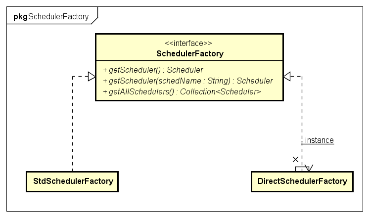
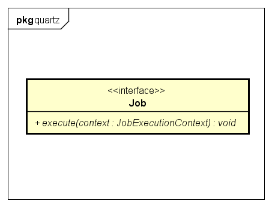

# Quartz

## Quartz 主要API
- Scheduler 任务调度器，按照特定的触发规则，自动执行任务
- Job 接口，通过实现该接口定义需要执行的任务
- JobDetail 用于定义Job实例，包含了job的基本信息
- Trigger 描述Job执行的时间触发规则
- JobStore 接口，存放Job

##Scheduler
Scheduler是一个任务调度器，保存JobDetail和Trigger的信息。 在Trigger触发时，执行特定任务。

###创建
Scheduler由SchedulerFactory创建。  
SchedulerFactory有两个默认实现StdSchedulerFactory和DirectSchedulerFactory。  
  

StdSchedulerFactory
DirectSchedulerFactory

###存储
Scheduler存储在单例的SchedulerRepository中。    
  
 
###生命周期
Scheduler的生命周期开始于start()，结束于shutdown()方法。  
  

###核心方法
Scheduler的核心功能就是操作Job、Trigger、Calendar、Listener等。包括addXXX、deleteXXX、pauseXXX、resumeXXX等。  

  

##Job 
Job就是定时任务实实在在执行的内容，足够单纯，仅仅包含一个执行方法:  
```java  
void execute(JobExecutionContext context) throws JobExecutionException;  
```  
JobExecutionContext对象包含了当前任务执行的上下文环境，包括Job、Trigger以及jobDataMap等。  
  

  
##Trigger
##


-----------------Draft  
Domain Specific Language(DSL)，链式操作  
Scheduler由SchedulerFactory创建，生命周期结束于shutdown()方法.任何计划任务开始于start()方法。
当Trigger被触发时，Scheduler的某个执行线程将会调用Job的execute(JobExecutionContext)方法。JobExecutionContext 包含一些运行时环境信息：包括调用该Job的Scheduler、Trigger、JobDetail以及其他信息。  
JobDetail在Job被添加到Schedler时被JobBuilder创建出来，用于保存Job的状态信息。
JobDetail在创建时需要传递Job的Class对象。Job的创建由Scheduler来完成，每次Trigger触发时，都会创建一个新的Job对象
JobDataMap扩展自java.util.Map，用于保存Job运行时所需的数据.；如果Job中包含与JobDataMap中key值相对应的setter方法，那么setter方法将会在job对象创建后调用
//TODO Job State and Concurrency
Job可以独立于Trigger存储于Scheduler中，一个Job可以关联多个Trigger.Job和Trigger相互对立，互相解耦。可以重新配置Job的Trigger当之前的Trigger过期或失效。可以修改一个Trigger而不用重新定义相关的Job
Job和Trigger在Scheduler都有唯一的标识符，在同一个group下唯一
Trigger由TriggerBuilder创建，用来触发调用Job执行。
Trigger包含几种一般的属性：
- TriggerKey：唯一标识符
- JobKey：job的唯一标识符，定位到一个Job，当Trigger被触发时，调用该Job
- startTime：trigger第一次执行的时间，java.util.Date类型
- endTime：trigger结束时间，java.util.Date类型
- Priority：当多个trigger拥有相同的触发时间，根据该属性来确定先后顺序，数值越大越靠前，默认5，可为正负数
- Misfire Instructions：没来得及执行的机制。同一时间trigger数量过多超过可获得的线程资源，导致部分trigger无法执行。不同类型的Trigger拥有不同的机制。当Scheduler启动时候，首先找到没来得及执行的trigger，再根据不同类型trigger各自的处理策略处理	
- Calendar：Quartz Calendar类型而不是java.util.Calendar类型。用于排除Trigger日程表中的特定时间范围，比如原本每天执行的任务，排除非工作日
常见的两种Trigger为SimpleTrigge和CronTrigger. 
SimpleTrigger支持在特定点一次性执行或延迟执行N次，使用TriggerBuilder和SimpleScheduleBuilder创建
SimpleTrigger包含的属性为：
- startTime
- endTime 如果指定的话，将会覆盖repeat count
- repeat count 重复次数 >=0 int
- repeat interval 时间间隔(毫秒) >=0 long

CronTrigger支持多次重复性复杂情况 支持Cron表达式，使用TriggerBuilder和CronScheduleBuilder 创建
Cron表达式由7部分组成，空格间隔
定时器表达式规则
字段 		允许值 			允许的特殊字符   
秒 			0-59 			, - * /   
分 			0-59 			, - * /   
小时 		0-23 			, - * /   
日期 		1-31 			, - * ? / L W C   
月份 		1-12,JAN-DEC	, - * /   
星期 		1-7,SUN-SAT , 	, - * ? / L C #   
年（可选） 留空,1970-2099	, - * /   

"*": 代表所有可能的值
"/": 用来指定数值的增量, 在子表达式（分钟）里的0/15表示从第0分钟开始，每15分钟;在子表达式（分钟）里的"3/20"表示从第3分钟开始，每20分钟（它和"3，23，43"）的含义一样
"?": 仅被用于天和星期两个子表达式，表示不指定值。当2个子表达式其中之一被指定了值以后，为了避免冲突，需要将另一个子表达式的值设为"?"
"L": 仅被用于天和星期两个子表达式，它是单词"last"的缩写。如果在“L”前有具体的内容，它就具有其他的含义了。例如："6L"表示这个月的倒数第６天，"FRI L"表示这个月的最后一个星期五  

'W' 可用于“日”字段。用来指定历给定日期最近的工作日(周一到周五) 。比如你将“日”字段设为"15W"，意为: "离该月15号最近的工作日"。因此如果15号为周六，触发器会在14号即周五调用。如果15号为周日, 触发器会在16号也就是周一触发。如果15号为周二,那么当天就会触发。然而如果你将“日”字段设为"1W", 而一号又是周六, 触发器会于下周一也就是当月的3号触发,因为它不会越过当月的值的范围边界。'W'字符只能用于“日”字段的值为单独的一天而不是一系列值的时候。 

'L'和'W'可以组合用于“日”字段表示为'LW'，意为"该月最后一个工作日"。 

'#' 字符可用于“周几”字段。该字符表示“该月第几个周×”，比如"6#3"表示该月第三个周五( 6表示周五而"#3"该月第三个)。再比如: "2#1" = 表示该月第一个周一而 "4#5" = 该月第五个周三。注意如果你指定"#5"该月没有第五个“周×”，该月是不会触发的。 

'C' 字符可用于“日”和“周几”字段，它是"calendar"的缩写。 它表示为基于相关的日历所计算出的值（如果有的话）。如果没有关联的日历, 那它等同于包含全部日历。“日”字段值为"5C"表示"日历中的第一天或者5号以后"，“周几”字段值为"1C"则表示"日历中的第一天或者周日以后"。 

表达式意义   
"0 0 12 * * ?" 每天中午12点触发   
"0 15 10 ? * *" 每天上午10:15触发   
"0 15 10 * * ?" 每天上午10:15触发   
"0 15 10 * * ? *" 每天上午10:15触发   
"0 15 10 * * ? 2005" 2005年的每天上午10:15触发   
"0 * 14 * * ?" 在每天下午2点到下午2:59期间的每1分钟触发   
"0 0/5 14 * * ?" 在每天下午2点到下午2:55期间的每5分钟触发   
"0 0/5 14,18 * * ?" 在每天下午2点到2:55期间和下午6点到6:55期间的每5分钟触发   
"0 0-5 14 * * ?" 在每天下午2点到下午2:05期间的每1分钟触发   
"0 10,44 14 ? 3 WED" 每年三月的星期三的下午2:10和2:44触发   
"0 15 10 ? * MON-FRI" 周一至周五的上午10:15触发   
"0 15 10 15 * ?" 每月15日上午10:15触发   
"0 15 10 L * ?" 每月最后一日的上午10:15触发   
"0 15 10 ? * 6L" 每月的最后一个星期五上午10:15触发   
"0 15 10 ? * 6L 2002-2005" 2002年至2005年的每月的最后一个星期五上午10:15触发   
"0 15 10 ? * 6#3" 每月的第三个星期五上午10:15触发   


定时器正则表达式验证
秒：	^(\\*|[0-5]?[0-9]([,|\\-|\\/][0-5]?[0-9])?)$
分：	^(\\*|[0-5]?[0-9]([,|\\-|\\/][0-5]?[0-9])?)$
时：	^(\\*|([0-1]?[0-9]?|2[0-3])([,|\\-|\\/]([0-1]?[0-9]|2[0-3]))?)$
日期：	^(\\*|\\?|([1-9]|[1-2][0-9]|3[0-1])[CLW]?|[CLW]|LW)$
月份：	^((\\*|[1-9]|(1[0-2]))([,|\\-|\\/]([1-9]|(1[0-2])))?)$
星期：	^(\\*|L|\\?|[1-7](([,|\\-|\\/|\\#][1-7])?|[LC]))$
年：	^((\\*?)|2[0-9]{3}([,|\\-|\\/]2[0-9]{3})?)$


Job Store
Job Store用于保存jobs, triggers, calendars对应数据。JobStore的配置应在Quartz的配置文件中配置，只能操作JobStore接口，不要直接操作JobStore实例
JobStroe的实现包括
- RAMJobStore：把所有数据保存在内容中，速度快但没能持久化。配置org.quartz.jobStore.class = org.quartz.simpl.RAMJobStore
- JDBCJobStore：通过jdbc把数据保存在数据库中。
- TerracottaJobStore：


